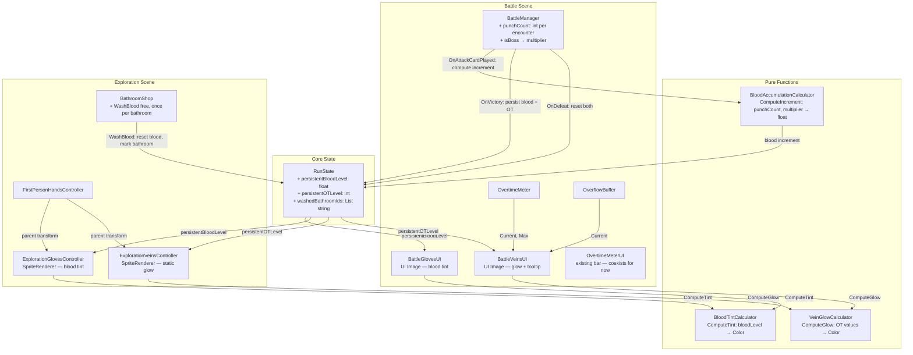

# Design Document: Bloody Gloves Mana

## Overview

This feature adds two separate visual systems to the player's hands:

1. **Blood on Gloves** — a purely cosmetic fight-history layer. Blood accumulates when the player plays attack cards (punches) during battle. The blood curve is exponential: early punches produce barely any blood, but as the battle goes on, each punch produces significantly more. Boss encounters have a higher blood multiplier. The maximum Blood_Level of 1.0 means fully red hands — the visual ceiling. Blood can be washed off for free in a BathroomShop, but each bathroom can only be used for washing once. Resets to 0 on defeat or new run.

2. **Mana Veins on Wrists** — a functional OT indicator rendered as glowing veins on the wrists just below the gloves. Vein brightness maps to the player's current OT value. The player starts each run with 10 OT, so veins have a faint glow from the start. OT is strictly a battle resource — veins in exploration are always static, showing the last battle's OT value. In battle, veins update in real-time as OT changes. Hovering over the wrist veins area shows an OT tooltip.

Both systems appear in the exploration scene (SpriteRenderer layers on first-person hands) and the battle scene (UI Image elements). They are visually and logically independent — blood tint only affects glove sprites, vein glow only affects wrist sprites.

### Key Design Decisions

1. **Two independent pure functions for rendering**: `BloodTintCalculator.ComputeTint` (blood level → color) and `VeinGlowCalculator.ComputeGlow` (OT values → glow color/intensity) are both static pure functions with no Unity state dependencies, enabling thorough property-based testing.
2. **Separate pure function for blood accumulation**: `BloodAccumulationCalculator.ComputeIncrement` computes the exponential blood increment per punch based on punch count, multiplier, and curve parameters. Also a static pure function.
3. **Two persistent fields on RunState**: `persistentBloodLevel` (float 0–1) for cosmetic blood and `persistentOTLevel` (int) for the last known OT value. Both leverage the existing SaveManager JSON pipeline.
4. **Per-bathroom wash tracking**: `washedBathroomIds` (List<string>) on RunState tracks which bathroom instances have been used for washing. Each bathroom has a unique instance ID.
5. **Blood is driven by punching, not damage taken**: Blood_Level increases only when the player plays attack cards. Taking damage does NOT produce blood.
6. **Exponential blood curve**: Uses the formula `baseIncrement * e^(growthRate * punchCount) * multiplier`, clamped so Blood_Level never exceeds 1.0.
7. **Boss multiplier**: Boss encounters use a higher Blood_Multiplier (e.g., 2.0x) than regular encounters (1.0x), configurable on GameConfig.
8. **OT is battle-only**: Veins in exploration are always static. No OT changes happen outside battle.
9. **Tooltip on veins, not gloves**: The battle tooltip (IPointerEnterHandler) is on the `BattleVeinsUI` component, not on the gloves.
10. **Bathroom washing is free but once-per-bathroom**: No currency cost, but each bathroom instance can only be used for washing once per run.
11. **Future: replace OvertimeMeterUI**: The existing OvertimeMeterUI bar will eventually be replaced by the glove veins system. For now, both coexist. The BattleVeinsUI is designed as a drop-in replacement for OvertimeMeterUI's informational role.

## Architecture



### Data Flow

**Blood System:**
1. **During Battle**: Each time the player plays an attack card, `BattleManager` increments a per-encounter `punchCount`. It then calls `BloodAccumulationCalculator.ComputeIncrement(punchCount, bloodMultiplier, curveParams)` to get the blood increment for that punch. The increment is added to a running `pendingBloodLevel` (starting from `RunState.persistentBloodLevel`), clamped to 1.0. The `BattleGlovesUI` updates its tint in real-time as punches land.
2. **Victory**: `BattleManager.OnVictory` writes the final `pendingBloodLevel` to `RunState.persistentBloodLevel` via `max(current, pending)` to enforce the ratchet. The `punchCount` resets for the next encounter.
3. **Exploration**: `ExplorationGlovesController` reads `persistentBloodLevel` on scene load, calls `BloodTintCalculator.ComputeTint`, applies color to glove SpriteRenderers. Static during exploration.
4. **Bathroom**: `BathroomShop.WashBlood(bathroomId)` checks if this bathroom has already been used for washing (via `RunState.washedBathroomIds`). If not, sets `persistentBloodLevel = 0`, adds the bathroom ID to `washedBathroomIds`, saves RunState. Exploration gloves update immediately.
5. **Defeat / New Run**: `SaveManager.WipeRun` resets `persistentBloodLevel = 0` and clears `washedBathroomIds`.

**Blood Multiplier:**
- Regular encounters: `bloodMultiplier = 1.0` (default)
- Boss encounters: `bloodMultiplier = gameConfig.bossBloodMultiplier` (e.g., 2.0)
- The multiplier is determined by `EncounterData.isBossEncounter` at encounter start.

**Vein System:**
1. **Battle (real-time)**: `BattleVeinsUI` subscribes to `BattleEventBus` events. On each event, reads `OvertimeMeter.Current`, `OvertimeMeter.Max`, `OverflowBuffer.Current`, calls `VeinGlowCalculator.ComputeGlow`, applies glow color to vein UI element.
2. **Victory**: `BattleManager.OnVictory` writes `OvertimeMeter.Current + OverflowBuffer.Current` to `RunState.persistentOTLevel`.
3. **Exploration**: `ExplorationVeinsController` reads `persistentOTLevel` on scene load, calls `VeinGlowCalculator.ComputeGlow` with the persisted OT and max OT from GameConfig, applies glow. Veins are always static during exploration — OT is strictly a battle resource.
4. **Defeat / New Run**: `SaveManager.WipeRun` resets `persistentOTLevel = 10` (starting OT).

**Future: OvertimeMeterUI Replacement:**
- Currently, both `OvertimeMeterUI` (existing dot-column bar) and `BattleVeinsUI` (new vein glow + tooltip) coexist in the battle scene.
- `BattleVeinsUI` is designed to fully replace `OvertimeMeterUI`'s informational role once the vein system is mature and tested.
- When ready, removing `OvertimeMeterUI` should require only deleting the GameObject and its script — no other battle systems depend on it for logic.

## Components and Interfaces

### BloodTintCalculator (Static Utility)

**File**: `Assets/Scripts/Battle/BloodTintCalculator.cs`

```csharp
public static class BloodTintCalculator
{
    /// <summary>
    /// Compute the blood tint color for gloves based on Blood_Level.
    /// Pure function — no Unity state dependencies.
    /// </summary>
    /// <param name="bloodLevel">Accumulated blood level (0.0–1.0)</param>
    /// <param name="baseColor">Glove color at 0 blood (white)</param>
    /// <param name="fullBloodColor">Glove color at max blood</param>
    /// <returns>Linearly interpolated tint color</returns>
    public static Color ComputeTint(float bloodLevel,
                                     Color baseColor, Color fullBloodColor)
    {
        float t = Mathf.Clamp01(bloodLevel);
        return Color.Lerp(baseColor, fullBloodColor, t);
    }
}
```

### BloodAccumulationCalculator (Static Utility)

**File**: `Assets/Scripts/Battle/BloodAccumulationCalculator.cs`

```csharp
public static class BloodAccumulationCalculator
{
    /// <summary>
    /// Compute the blood increment for a single punch based on the exponential curve.
    /// Early punches produce barely any blood; later punches produce much more.
    /// Pure function — no Unity state dependencies.
    /// </summary>
    /// <param name="punchCount">Number of attack cards played so far in this encounter (1-based)</param>
    /// <param name="bloodMultiplier">Encounter multiplier (1.0 for regular, higher for bosses)</param>
    /// <param name="baseIncrement">Base blood per punch at the start of the curve (e.g., 0.005)</param>
    /// <param name="growthRate">Exponential growth rate (e.g., 0.15)</param>
    /// <returns>Blood increment for this punch, always >= 0</returns>
    public static float ComputeIncrement(int punchCount, float bloodMultiplier,
                                          float baseIncrement, float growthRate)
    {
        if (punchCount <= 0) return 0f;
        float increment = baseIncrement * Mathf.Exp(growthRate * (punchCount - 1)) * bloodMultiplier;
        return Mathf.Max(0f, increment);
    }

    /// <summary>
    /// Compute the new Blood_Level after a punch, enforcing the ratchet and cap.
    /// </summary>
    /// <param name="currentBloodLevel">Current persistent Blood_Level (0.0–1.0)</param>
    /// <param name="increment">Blood increment from ComputeIncrement</param>
    /// <returns>New Blood_Level, clamped to [currentBloodLevel, 1.0]</returns>
    public static float ApplyIncrement(float currentBloodLevel, float increment)
    {
        float clamped = Mathf.Clamp01(currentBloodLevel);
        return Mathf.Clamp(clamped + Mathf.Max(0f, increment), clamped, 1f);
    }
}
```

### VeinGlowCalculator (Static Utility)

**File**: `Assets/Scripts/Battle/VeinGlowCalculator.cs`

```csharp
public static class VeinGlowCalculator
{
    /// <summary>
    /// Compute the vein glow color/intensity based on OT values.
    /// Pure function — no Unity state dependencies.
    /// </summary>
    public static Color ComputeGlow(int currentOT, int maxOT, int overflowOT,
                                     Color dimColor, Color brightColor)
    {
        if (maxOT <= 0) return dimColor;
        float ratio = (float)(currentOT + overflowOT) / maxOT;
        float t = Mathf.Clamp01(ratio);
        Color glow = Color.Lerp(dimColor, brightColor, t);
        if (ratio > 1f)
        {
            float excess = Mathf.Clamp01(ratio - 1f);
            glow = Color.Lerp(glow, new Color(0.4f, 0.8f, 1f, 1f), excess * 0.5f);
        }
        return glow;
    }

    /// <summary>
    /// Compute glow from a pre-stored OT value (for exploration scene).
    /// </summary>
    public static Color ComputeGlowFromStored(int storedOT, int maxOT,
                                                Color dimColor, Color brightColor)
    {
        return ComputeGlow(storedOT, maxOT, 0, dimColor, brightColor);
    }
}
```

### BattleGlovesUI (MonoBehaviour)

**File**: `Assets/Scripts/Battle/UI/BattleGlovesUI.cs`

No tooltip — blood gloves are purely visual in battle. Updates tint in real-time as attack cards are played.

```csharp
public class BattleGlovesUI : MonoBehaviour
{
    [SerializeField] Image gloveImage;
    [SerializeField] Color baseGloveColor = Color.white;
    [SerializeField] Color fullBloodColor = new Color(0.8f, 0.05f, 0.05f, 1f);

    public void Initialize(float bloodLevel);
    public void Refresh(float bloodLevel);
}
```

### BattleVeinsUI (MonoBehaviour)

**File**: `Assets/Scripts/Battle/UI/BattleVeinsUI.cs`

Implements `IPointerEnterHandler`, `IPointerExitHandler` for OT tooltip. Coexists with the existing `OvertimeMeterUI` for now — designed as its eventual replacement.

```csharp
public class BattleVeinsUI : MonoBehaviour, IPointerEnterHandler, IPointerExitHandler
{
    [SerializeField] Image veinImage;
    [SerializeField] Color dimGlowColor = new Color(0.1f, 0.2f, 0.4f, 0.3f);
    [SerializeField] Color brightGlowColor = new Color(0.3f, 0.7f, 1f, 1f);
    [SerializeField] OvertimeMeter overtimeMeter;
    [SerializeField] OverflowBuffer overflowBuffer;
    [SerializeField] TextMeshProUGUI tooltipText;

    public void Initialize(OvertimeMeter meter, OverflowBuffer overflow);
    public void Refresh();
    public void OnPointerEnter(PointerEventData eventData);
    public void OnPointerExit(PointerEventData eventData);
}
```

### ExplorationGlovesController (MonoBehaviour)

**File**: `Assets/Scripts/Exploration/ExplorationGlovesController.cs`

```csharp
public class ExplorationGlovesController : MonoBehaviour
{
    [SerializeField] SpriteRenderer leftGloveRenderer;
    [SerializeField] SpriteRenderer rightGloveRenderer;
    [SerializeField] Color baseGloveColor = Color.white;
    [SerializeField] Color fullBloodColor = new Color(0.8f, 0.05f, 0.05f, 1f);

    public void ApplyBloodTint(float bloodLevel);
}
```

### ExplorationVeinsController (MonoBehaviour)

**File**: `Assets/Scripts/Exploration/ExplorationVeinsController.cs`

Veins are always static during exploration — reads the persisted OT value once on scene load.

```csharp
public class ExplorationVeinsController : MonoBehaviour
{
    [SerializeField] SpriteRenderer leftVeinRenderer;
    [SerializeField] SpriteRenderer rightVeinRenderer;
    [SerializeField] Color dimGlowColor = new Color(0.1f, 0.2f, 0.4f, 0.3f);
    [SerializeField] Color brightGlowColor = new Color(0.3f, 0.7f, 1f, 1f);

    public void ApplyVeinGlow(int storedOT, int maxOT);
}
```

The `SpriteRenderer` components for both gloves and veins are children of the existing left/right hand transforms in `FirstPersonHandsController`, so they automatically inherit position, bob, and animation offsets. Glove sorting order is one layer above hands; vein sorting order is one layer below gloves.

### Integration Points

| Hook Point | What Happens |
|---|---|
| `BattleManager.StartEncounter` | Reads `RunState.persistentBloodLevel` → `BattleGlovesUI.Initialize(bloodLevel)`. Calls `BattleVeinsUI.Initialize(overtimeMeter, overflowBuffer)`. Resets per-encounter `punchCount = 0`. Determines `bloodMultiplier` from `EncounterData.isBossEncounter`. |
| `BattleManager.TryPlayCard` (attack cards) | Increments `punchCount`, calls `BloodAccumulationCalculator.ComputeIncrement`, updates `pendingBloodLevel`, refreshes `BattleGlovesUI`. |
| `BattleManager.OnVictory` | Writes `max(RunState.persistentBloodLevel, pendingBloodLevel)` to RunState (ratchet). Writes `OvertimeMeter.Current + OverflowBuffer.Current` to `RunState.persistentOTLevel`. |
| `BattleManager.OnDefeat` | Triggers `SaveManager.WipeRun()` which resets both fields and clears `washedBathroomIds`. |
| `BattleEventBus` events | `BattleVeinsUI.Refresh()` called on card played, turn phase change, overflow, damage. |
| `ExplorationGlovesController.Start` | Reads `RunState.persistentBloodLevel`, calls `ApplyBloodTint`. |
| `ExplorationVeinsController.Start` | Reads `RunState.persistentOTLevel` and `GameConfig.overtimeMaxCapacity`, calls `ApplyVeinGlow`. Static — no updates during exploration. |
| `BathroomShop.WashBlood(bathroomId)` | Checks `washedBathroomIds`, if not washed: sets `persistentBloodLevel = 0`, adds ID to list, saves RunState. Notifies `ExplorationGlovesController` to refresh. |
| `RunStartController` / `SaveManager.WipeRun` | Resets `persistentBloodLevel = 0`, `persistentOTLevel = 10`, clears `washedBathroomIds`. |

### BathroomShop Integration

Add `WashBlood(string bathroomId)` method to the existing `BathroomShop` class:

```csharp
/// <summary>
/// Washes blood off the player's gloves, resetting Blood_Level to 0.
/// Free (no currency cost), but each bathroom can only be used once for washing.
/// </summary>
/// <param name="bathroomId">Unique ID for this bathroom instance</param>
public bool WashBlood(string bathroomId)
{
    RunState run = GetRunState();
    if (run == null) return false;

    // Check if this bathroom has already been used for washing
    if (run.washedBathroomIds != null && run.washedBathroomIds.Contains(bathroomId))
    {
        Debug.Log("BathroomShop: This bathroom has already been used for washing.");
        return false;
    }

    // Reset blood level (free — no currency cost)
    run.persistentBloodLevel = 0f;

    // Mark this bathroom as washed
    if (run.washedBathroomIds == null)
        run.washedBathroomIds = new List<string>();
    run.washedBathroomIds.Add(bathroomId);

    if (SaveManager.Instance != null)
        SaveManager.Instance.SaveRun();

    return true;
}

/// <summary>
/// Returns true if this bathroom can still be used for blood washing.
/// </summary>
public bool CanWashBlood(string bathroomId)
{
    RunState run = GetRunState();
    if (run == null) return false;
    if (run.persistentBloodLevel <= 0f) return false;
    if (run.washedBathroomIds != null && run.washedBathroomIds.Contains(bathroomId))
        return false;
    return true;
}
```

This sits alongside the existing `PurchaseCard`, `PurchaseTool`, and `RemoveCard` methods. The UI will present it as an additional option in the bathroom. Each bathroom instance needs a unique ID (e.g., `$"bathroom_{currentFloor}_{roomIndex}"`) assigned at generation time.

## Data Models

### RunState Extension

Add fields to the existing `RunState` class:

```csharp
/// <summary>
/// Accumulated blood level on gloves (0.0–1.0). Purely cosmetic fight history.
/// Increases when the player plays attack cards. Reset to 0 on defeat or new run.
/// Can be washed off in BathroomShop (free, once per bathroom).
/// </summary>
public float persistentBloodLevel;

/// <summary>
/// Last known OT value (including overflow) from the most recent battle.
/// Used to drive vein glow in exploration (always static — OT is battle-only).
/// Reset to 10 on new run.
/// </summary>
public int persistentOTLevel = 10;

/// <summary>
/// List of bathroom instance IDs where the player has already washed blood.
/// Each bathroom can only be used for washing once per run.
/// </summary>
public List<string> washedBathroomIds;
```

All fields are serialized by the existing `SaveManager` JSON pipeline — no additional save/load code is needed.

### GameConfig Extension

Add blood curve configuration fields to the existing `GameConfig` ScriptableObject:

```csharp
[Header("Blood Accumulation")]
/// <summary>Base blood increment per punch at the start of the exponential curve.</summary>
public float bloodBaseIncrement = 0.005f;

/// <summary>Exponential growth rate for blood per punch.</summary>
public float bloodGrowthRate = 0.15f;

/// <summary>Blood multiplier for regular encounters.</summary>
public float regularBloodMultiplier = 1.0f;

/// <summary>Blood multiplier for boss encounters (higher = more blood per punch).</summary>
public float bossBloodMultiplier = 2.0f;
```

### BloodTintCalculator Input/Output

| Parameter | Type | Range | Description |
|---|---|---|---|
| `bloodLevel` | float | 0.0–1.0 | Accumulated blood from fights |
| `baseColor` | Color | — | Glove color at 0 blood (white) |
| `fullBloodColor` | Color | — | Glove color at max blood (deep red = fully red hands) |
| **Return** | Color | — | Linearly interpolated tint color |

### BloodAccumulationCalculator Input/Output

| Parameter | Type | Range | Description |
|---|---|---|---|
| `punchCount` | int | >= 1 | Attack cards played so far in this encounter |
| `bloodMultiplier` | float | > 0 | Encounter multiplier (1.0 regular, 2.0 boss) |
| `baseIncrement` | float | > 0 | Base blood per punch at curve start |
| `growthRate` | float | > 0 | Exponential growth rate |
| **Return** | float | >= 0 | Blood increment for this punch |

### VeinGlowCalculator Input/Output

| Parameter | Type | Range | Description |
|---|---|---|---|
| `currentOT` | int | 0..max | Current Overtime meter value |
| `maxOT` | int | > 0 | Maximum Overtime capacity |
| `overflowOT` | int | >= 0 | Overflow buffer points |
| `dimColor` | Color | — | Vein color at minimum glow |
| `brightColor` | Color | — | Vein color at full glow |
| **Return** | Color | — | Interpolated glow color (intensified beyond 1.0 for overflow) |

### Blood Accumulation Formula (Exponential Curve)

```
increment = baseIncrement * e^(growthRate * (punchCount - 1)) * bloodMultiplier
newBloodLevel = clamp(currentBloodLevel + increment, currentBloodLevel, 1.0)
```

Where:
- `baseIncrement` (e.g., 0.005): tiny blood per early punch
- `growthRate` (e.g., 0.15): controls how fast the curve ramps up
- `punchCount`: 1-based count of attack cards played this encounter
- `bloodMultiplier`: 1.0 for regular encounters, `gameConfig.bossBloodMultiplier` (e.g., 2.0) for bosses
- The `max` in `clamp` ensures the ratchet property — blood never decreases from a punch

**Example curve (regular encounter, multiplier=1.0, base=0.005, rate=0.15):**
- Punch 1: 0.005 (barely visible)
- Punch 5: 0.009
- Punch 10: 0.019
- Punch 15: 0.041
- Punch 20: 0.087
- Punch 30: 0.383

**Boss encounter (multiplier=2.0):** all values doubled.

### Vein Glow Formula

```
ratio = (currentOT + overflowOT) / maxOT
t = clamp01(ratio)
glow = lerp(dimColor, brightColor, t)
if ratio > 1:
    excess = clamp01(ratio - 1)
    glow = lerp(glow, intensifiedColor, excess * 0.5)
```


## Correctness Properties

*A property is a characteristic or behavior that should hold true across all valid executions of a system — essentially, a formal statement about what the system should do. Properties serve as the bridge between human-readable specifications and machine-verifiable correctness guarantees.*

### Property 1: Blood accumulation ratchet and cap

*For any* current Blood_Level in [0, 1] and any non-negative blood increment, applying the increment SHALL produce a new Blood_Level that is greater than or equal to the input Blood_Level and less than or equal to 1.0.

**Validates: Requirements 1.1, 1.4, 1.8**

### Property 2: RunState persistence round-trip

*For any* Blood_Level value in [0, 1], persistentOTLevel integer, and list of washedBathroomIds strings, setting them on a RunState, serializing to JSON, and deserializing back SHALL produce a RunState with the same values (Blood_Level within float precision, washedBathroomIds with same contents).

**Validates: Requirements 1.7, 2.4**

### Property 3: Exponential curve monotonicity

*For any* two punch counts where punchA < punchB (both >= 1), with the same positive bloodMultiplier, baseIncrement, and growthRate, calling `BloodAccumulationCalculator.ComputeIncrement(punchB, ...)` SHALL return a value greater than or equal to `ComputeIncrement(punchA, ...)`.

**Validates: Requirements 1.2**

### Property 4: Boss multiplier produces more blood

*For any* punchCount >= 1 and positive curve parameters, calling `BloodAccumulationCalculator.ComputeIncrement` with a higher bloodMultiplier SHALL return a value greater than or equal to calling it with a lower bloodMultiplier.

**Validates: Requirements 1.3**

### Property 5: Bathroom wash resets blood and blocks re-wash

*For any* Blood_Level > 0 and any bathroomId string, calling `WashBlood(bathroomId)` SHALL set persistentBloodLevel to 0.0 without deducting any currency, and a subsequent call to `WashBlood` with the same bathroomId SHALL return false (bathroom already used).

**Validates: Requirements 2.2, 2.3, 2.5**

### Property 6: Blood tint interpolation correctness

*For any* Blood_Level in [0, 1] and any baseColor and fullBloodColor, calling `BloodTintCalculator.ComputeTint` SHALL return a color equal to `Color.Lerp(baseColor, fullBloodColor, clamp01(bloodLevel))`. At Blood_Level 0 the result equals baseColor; at Blood_Level 1 the result equals fullBloodColor.

**Validates: Requirements 3.1, 3.2, 3.3, 3.4, 10.1**

### Property 7: Vein glow monotonicity

*For any* two input sets sharing the same maxOT (> 0), dimColor, and brightColor, where the effective ratio `(currentOT_A + overflowOT_A) / maxOT` is less than or equal to `(currentOT_B + overflowOT_B) / maxOT`, the brightness (average of RGB channels) of `ComputeGlow(A)` SHALL be less than or equal to the brightness of `ComputeGlow(B)`.

**Validates: Requirements 4.2, 4.4, 10.2**

### Property 8: Tooltip format correctness

*For any* currentOT (>= 0), maxOT (> 0), and overflowOT (>= 0), the tooltip display string SHALL equal `"{currentOT + overflowOT}/{maxOT}"`.

**Validates: Requirements 7.4**

### Property 9: Pure function idempotence

*For any* valid inputs to `BloodTintCalculator.ComputeTint`, `BloodAccumulationCalculator.ComputeIncrement`, or `VeinGlowCalculator.ComputeGlow`, calling the function twice with identical arguments SHALL produce identical output values.

**Validates: Requirements 10.4**

## Error Handling

| Scenario | Behavior |
|---|---|
| Glove or vein sprite references are null | Log `Debug.LogWarning`, disable the affected renderer/image, continue without rendering. Game does not crash. |
| OvertimeMeter reference is null in battle | `BattleVeinsUI` logs warning, displays veins with dim glow color. Tooltip shows "Overtime: --/--". |
| OverflowBuffer reference is null | Treat overflow as 0. No warning (overflow is optional). |
| maxOT is 0 | `VeinGlowCalculator.ComputeGlow` returns `dimColor` immediately (guard clause). No division by zero. |
| Blood_Level is NaN or negative in RunState | Clamp to 0 before applying tint. Log warning. |
| Blood_Level > 1.0 in RunState | Clamp to 1.0 before applying tint. Log warning. |
| persistentOTLevel is negative in RunState | Clamp to 0 before computing glow. Log warning. |
| SaveManager.Instance is null when reading persistent values | Default to bloodLevel=0, otLevel=10. Log warning. |
| No custom sprites assigned | Use default white square sprite as placeholder. Log warning. |
| WashBlood called with null or empty bathroomId | Return false, log warning. |
| washedBathroomIds is null when checking | Treat as empty list (no bathrooms washed yet). |
| punchCount <= 0 passed to ComputeIncrement | Return 0 (no blood from non-punches). |
| bloodMultiplier <= 0 | Clamp to minimum of 0, effectively producing 0 increment. |

## Testing Strategy

### Property-Based Tests (NUnit, manual randomized iterations)

The project uses a manual randomized iteration pattern (see `OvertimeMeterPropertyTests.cs`): `System.Random` with a fixed seed, 200 iterations per property, NUnit `[Test]` attributes.

**Test file**: `Assets/Tests/EditMode/Battle/BloodGlovesManaPropertyTests.cs`

Each property test will:
- Use 200 iterations minimum
- Use `System.Random` with a fixed seed for reproducibility
- Reference the design property in a summary comment
- Tag format: `Feature: bloody-gloves-mana, Property {N}: {title}`

**Properties to implement:**
1. Blood accumulation ratchet and cap — generate random (currentBloodLevel, increment), verify ApplyIncrement output >= input and <= 1.0
2. RunState persistence round-trip — generate random (Blood_Level, persistentOTLevel, washedBathroomIds), serialize/deserialize, verify equality
3. Exponential curve monotonicity — generate pairs of punchCounts (a < b) with same params, verify ComputeIncrement(b) >= ComputeIncrement(a)
4. Boss multiplier produces more blood — generate random punchCount and params, verify higher multiplier → higher or equal increment
5. Bathroom wash resets blood and blocks re-wash — generate random Blood_Level > 0 and bathroomId, verify wash sets to 0 and second wash fails
6. Blood tint interpolation correctness — generate random (bloodLevel, baseColor, fullBloodColor), verify output matches Color.Lerp
7. Vein glow monotonicity — generate pairs of OT inputs with ordered ratios, verify brightness ordering
8. Tooltip format correctness — generate random OT values, verify format string
9. Pure function idempotence — generate random inputs for all three functions, call twice, assert equality

### Unit Tests (Example-Based)

**Test file**: `Assets/Tests/EditMode/Battle/BattleGlovesUITests.cs`

- Blood_Level resets to 0 on new run / WipeRun (Req 1.5, 6.1, 6.3)
- persistentOTLevel resets to 10 on new run / WipeRun (Req 5.1, 6.2, 6.3)
- washedBathroomIds cleared on new run / WipeRun (Req 2.4)
- Veins show faint glow at starting OT of 10 (Req 4.6, 5.2)
- Tooltip shows "Overtime" label on vein hover (Req 7.1)
- Tooltip hides on pointer exit (Req 7.2)
- Tooltip does NOT appear on glove hover (Req 7.5)
- Null sprites log warning and use default (Req 11.5, 12.1)
- Null OvertimeMeter shows minimum glow with warning (Req 12.2)
- BathroomShop.WashBlood resets blood to 0 (Req 2.2)
- BathroomShop.CanWashBlood returns false for already-washed bathroom (Req 2.5)
- BathroomShop.WashBlood does not deduct currency (Req 2.2)
- ComputeIncrement returns 0 for punchCount <= 0 (Req 12 edge case)
- Gloves and veins visible across all turn phases (Req 9.3)

### Integration Tests

- Victory stores correct persistentBloodLevel (ratcheted) in RunState after attack cards played (Req 1.1)
- Victory stores correct persistentOTLevel in RunState (Req 4.5)
- Blood tint updates in real-time during battle as attack cards are played (Req 1.1)
- Exploration scene reads both persistent values and applies correct visuals (Req 8.1, 8.2)
- Battle scene initializes both glove tint and vein glow on load (Req 9.1, 9.2)
- Vein glow updates in real-time when OT changes during battle (Req 4.3)
- Exploration veins are static — no updates during exploration (Req 4.5)
- Tooltip updates in real time when OT changes while visible (Req 7.3)
- BathroomShop wash triggers immediate exploration glove update (Req 2.7)
- First battle initializes veins with starting OT glow (Req 5.3)
- Boss encounters produce more blood per punch than regular encounters (Req 1.3)
- Both OvertimeMeterUI and BattleVeinsUI coexist in battle scene (Req 13.1)
