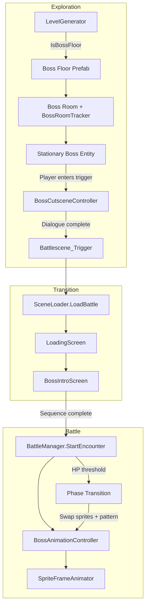

# Design Document: Boss Encounter System

## Overview

The Boss Encounter System introduces a structured boss fight pipeline into the existing card-battle roguelike. It covers:

1. A revised boss floor schedule (floor 1, then every `bossFloorInterval` floors).
2. New data fields on `EnemyCombatantData` for boss title, pose, animation, and phase 2.
3. Stationary boss behavior during exploration (no patrol, no chase).
4. A pre-battle dialogue cutscene triggered on entering the boss room.
5. A cinematic boss intro screen that plays between the loading screen and battle start.
6. Clean integration with the existing `SceneLoader` → `LoadingScreen` → `BattleManager` pipeline.
7. Boss positioning with sitting/standing poses and billboard rotation.
8. A sprite-frame animation system for boss idle, damaged, attack, and death states.
9. A second-phase system that swaps sprites, attack patterns, and animations at an HP threshold.

The design extends existing ScriptableObjects and MonoBehaviours rather than replacing them, ensuring zero impact on non-boss encounters.

## Architecture



### Key Design Decisions

- **Boss floor formula change**: The current `IsBossFloor` uses `floor % interval == 0` (floors 3, 6, 9...). The new formula is `floor == 1 || (floor > 1 && (floor - 1) % interval == 0)` producing floors 1, 4, 7, 10... This is a pure logic change in `LevelGenerator.IsBossFloor`.
- **Stationary boss via data flag**: Rather than a new AI state machine, the existing `EnemyFollow` is simply disabled on boss entities. The boss prefab uses a dedicated `BossExplorationEntity` component that handles billboard rotation and pose rendering.
- **Boss intro as UI overlay**: `BossIntroScreen` is a Canvas-based UI panel (like `VictoryScreen`) that plays a label animation sequence. It lives in the battle scene and is activated by `BattleManager` when `isBossEncounter` is true.
- **Sprite-frame animation without Unity Animator**: Boss animations use a lightweight `SpriteFrameAnimator` component that cycles through `Sprite[]` arrays at a configurable frame rate, matching the existing `LoadingScreen` icon animation pattern. This avoids Animator Controller overhead for simple frame-by-frame sprites.
- **Phase 2 as data swap**: Phase transition doesn't create a new enemy — it swaps the active sprite set, attack pattern, and animation data on the existing `EnemyCombatant` at runtime.

## Components and Interfaces

### New Components

#### `BossExplorationEntity` (MonoBehaviour)
Attached to the boss prefab in the boss room during exploration. Handles stationary positioning, pose rendering, and billboard rotation.

```csharp
public class BossExplorationEntity : MonoBehaviour
{
    // Set by LevelGenerator when spawning the boss
    public EnemyCombatantData BossData { get; set; }

    // Renders sitting (chair + boss sprite) or standing (boss sprite only)
    // Billboard rotates the sprite to face the camera on Y-axis
    void Update(); // Billboard rotation logic
}
```

#### `BossCutsceneController` (MonoBehaviour)
Trigger-volume component in the boss room. When the player enters, it displays `preFightDialogue`, pauses input, and on dismiss initiates the battle transition.

```csharp
public class BossCutsceneController : MonoBehaviour
{
    [SerializeField] EnemyCombatantData bossData;
    [SerializeField] Battlescene_Trigger battleTrigger;

    // Displays dialogue UI, pauses player input
    // On dismiss → battleTrigger.TriggerEncounter()
    // If preFightDialogue is null/empty → skip straight to trigger
}
```

#### `BossIntroScreen` (MonoBehaviour)
UI panel in the battle scene. Plays the "Introducing..." → boss name → boss title label animation sequence.

```csharp
public class BossIntroScreen : MonoBehaviour
{
    [SerializeField] float slideDuration;
    [SerializeField] float holdDuration;

    public void Play(string bossName, string bossTitle, System.Action onComplete);
    // Animates labels, calls onComplete when done
}
```

#### `SpriteFrameAnimator` (MonoBehaviour)
Lightweight sprite-frame animation player. Cycles through a `Sprite[]` at a given frame rate on a `SpriteRenderer`.

```csharp
public class SpriteFrameAnimator : MonoBehaviour
{
    public void Play(SpriteFrameAnimation anim, bool loop = true, System.Action onComplete = null);
    public void Stop();
    public bool IsPlaying { get; }
}
```

#### `BossAnimationController` (MonoBehaviour)
Per-boss component that manages which `SpriteFrameAnimation` to play based on battle state (idle, damaged, attack, death). Holds references to phase 1 and phase 2 animation sets.

```csharp
public class BossAnimationController : MonoBehaviour
{
    public BossAnimationData Phase1Animations;
    public BossAnimationData Phase2Animations;

    public void PlayIdle();
    public void PlayDamaged(System.Action onComplete);
    public void PlayAttack(EnemyActionType actionType, System.Action onComplete);
    public void PlayDeath(System.Action onComplete);
    public void SwitchToPhase2();
}
```

### Modified Components

#### `LevelGenerator`
- `IsBossFloor(int floor)` — updated formula: `floor == 1 || (floor > 1 && (floor - 1) % bossFloorInterval == 0)`.
- Boss spawning logic updated to place a `BossExplorationEntity` + `BossCutsceneController` instead of a roaming `EnemyFollow`.

#### `EnemyCombatantData` (ScriptableObject)
- New fields: `bossTitle`, `bossPose`, `bossAnimationData`, `phase2Data`.

#### `BattleManager`
- `StartEncounter` checks `isBossEncounter`. If true, activates `BossIntroScreen` and defers `StartEncounter` logic until the intro completes.
- During battle, delegates animation calls to `BossAnimationController` when the enemy is a boss.
- Monitors boss HP for phase 2 threshold crossing.

#### `SceneLoader`
- No API signature changes. The existing `LoadBattle(EncounterData, string)` already passes `isBossEncounter` through `EncounterData`.

### Unchanged Components
- `EnemyFollow` — not used for bosses (disabled on boss entities).
- `LoadingScreen` — no changes; boss intro plays after loading screen completes.
- `VictoryScreen` — no changes; already handles boss rewards via `isBossEncounter`.
- `Battlescene_Trigger` — no changes; `TriggerEncounter()` already supports programmatic invocation.

## Data Models

### `EnemyCombatantData` — New Fields

```csharp
public enum BossPose { Standing, Sitting }

// Added to existing EnemyCombatantData ScriptableObject:
[Header("Boss Data")]
public string bossTitle;                    // e.g. "The Executive"
public BossPose bossPose;                   // Standing (floor 1) or Sitting (others)
public BossAnimationData bossAnimationData; // Phase 1 animation set

[Header("Boss Phase 2")]
public BossPhase2Data phase2Data;           // null if boss has no phase 2
```

### `BossAnimationData` (Serializable class)

```csharp
[System.Serializable]
public class BossAnimationData
{
    public SpriteFrameAnimation idleAnimation;
    public SpriteFrameAnimation damagedAnimation;
    public SpriteFrameAnimation deathAnimation;
    public List<BossAttackAnimation> attackAnimations; // mapped by EnemyActionType
}

[System.Serializable]
public class BossAttackAnimation
{
    public EnemyActionType actionType;
    public SpriteFrameAnimation animation;
}
```

### `SpriteFrameAnimation` (Serializable class)

```csharp
[System.Serializable]
public class SpriteFrameAnimation
{
    public Sprite[] frames;
    public float frameRate = 8f;  // frames per second
    public bool loop = true;
}
```

### `BossPhase2Data` (Serializable class)

```csharp
[System.Serializable]
public class BossPhase2Data
{
    [Range(0f, 1f)]
    public float hpThresholdPercent = 0.5f;  // triggers at 50% HP by default
    public List<EnemyAction> phase2AttackPattern;
    public Sprite[] phase2SpriteSet;
    public BossAnimationData phase2Animations;
}
```

### `GameConfig` — New Fields

```csharp
[Header("Boss Intro Screen")]
public float bossIntroSlideDuration = 0.6f;
public float bossIntroHoldDuration = 1.5f;

[Header("Boss Phase Transition")]
public float phaseTransitionPauseDuration = 1.0f;
```


## Correctness Properties

*A property is a characteristic or behavior that should hold true across all valid executions of a system — essentially, a formal statement about what the system should do. Properties serve as the bridge between human-readable specifications and machine-verifiable correctness guarantees.*

### Property 1: Boss Floor Schedule Formula

*For any* positive floor number and any positive `bossFloorInterval`, `IsBossFloor(floor)` shall return true if and only if `floor == 1` or `(floor > 1 && (floor - 1) % bossFloorInterval == 0)`. The function is deterministic: calling it twice with the same inputs always produces the same result.

**Validates: Requirements 1.2, 1.5**

### Property 2: Boss Title Visibility Decision

*For any* `bossTitle` string, the boss intro screen shall display the title label if and only if the string is non-null and non-empty. For any null or empty `bossTitle`, the title label shall be omitted.

**Validates: Requirements 2.2, 5.5**

### Property 3: Dialogue Skip on Empty Pre-Fight Dialogue

*For any* `EnemyCombatantData` where `preFightDialogue` is null or empty (whitespace-only counts as empty), the cutscene controller shall skip the dialogue sequence and immediately initiate the battle transition. For any non-empty `preFightDialogue`, the dialogue shall be displayed.

**Validates: Requirements 4.4**

### Property 4: Boss Intro Screen Gating

*For any* `EncounterData`, the boss intro screen shall play if and only if `isBossEncounter` is true. When `isBossEncounter` is false, the battle shall start immediately without the intro sequence.

**Validates: Requirements 5.8**

### Property 5: Boss Pose Assignment by Floor

*For any* boss floor number, if the floor is floor 1 then the assigned boss shall have `bossPose == Standing`. For any boss floor number greater than 1, the assigned boss shall have `bossPose == Sitting`.

**Validates: Requirements 7.5, 7.6**

### Property 6: Attack Animation Lookup

*For any* `BossAnimationData` and any `EnemyActionType` that has a mapped entry in `attackAnimations`, looking up the animation for that action type shall return the correct `SpriteFrameAnimation`. For any action type without a mapping, the lookup shall return null.

**Validates: Requirements 8.8**

### Property 7: Phase 2 Trigger Condition

*For any* boss with `phase2Data` configured, and *for any* `maxHP > 0` and `hpThresholdPercent` in (0, 1], the phase transition shall trigger when `currentHP <= floor(maxHP * hpThresholdPercent)` and the boss is still alive (`currentHP > 0`). When `currentHP > floor(maxHP * hpThresholdPercent)`, no transition shall occur.

**Validates: Requirements 9.3**

### Property 8: Phase 2 Attack Pattern Swap

*For any* boss that has undergone a phase transition, the active attack pattern used for all subsequent enemy turns shall be the `phase2AttackPattern` from `phase2Data`, not the original phase 1 pattern.

**Validates: Requirements 9.6, 9.8**

### Property 9: Phase Transition Occurs At Most Once

*For any* boss encounter, regardless of how many times the boss's HP crosses below the phase 2 threshold (e.g., healing effects, multiple damage instances), the phase transition shall be triggered at most once. A boolean flag tracks whether the transition has already occurred.

**Validates: Requirements 9.9**

## Error Handling

| Scenario | Handling |
|---|---|
| `BossIntroScreen` reference is null in battle scene | `BattleManager` falls back to starting the encounter immediately (Req 6.5). |
| `preFightDialogue` is null or empty | `BossCutsceneController` skips dialogue, triggers battle transition directly (Req 4.4). |
| `bossTitle` is null or empty | `BossIntroScreen` omits the title label; name-only intro plays (Req 2.2). |
| `bossAnimationData` is null on a boss | `BattleManager` uses the existing generic death/hit animations from `BattleAnimations` as fallback. |
| `phase2Data` is null on a boss | No phase transition occurs; boss runs phase 1 pattern for the entire fight. |
| Boss killed in one hit through phase 2 threshold | Phase transition is skipped; death animation plays immediately (Req 9.10). |
| `bossFloorPrefabs` pool is empty | `LevelGenerator` falls back to the regular `floorPrefabs` pool (existing behavior). |
| `BossRoomTracker` not found by `BossFloorGate` | Warning logged; gate cannot force-engage (existing behavior). |
| `SpriteFrameAnimator` receives animation with 0 frames | Animator does nothing; logs a warning. |

## Testing Strategy

### Dual Testing Approach

Both unit tests and property-based tests are required for comprehensive coverage.

- **Unit tests**: Verify specific examples (floor 1 is boss, interval=3 produces 1,4,7,10,13), edge cases (boss killed through threshold, null animation data), and integration points (BossIntroScreen callback fires).
- **Property tests**: Verify universal properties across randomized inputs (boss floor formula for all floors/intervals, phase transition trigger for all HP/threshold combinations, attack animation lookup for all action types).

### Property-Based Testing Configuration

- **Library**: NUnit with manual iteration loops (matching existing project pattern in `FloorGenerationPropertyTests.cs`).
- **Iterations**: Minimum 200 per property test (matching existing project convention).
- **Tagging**: Each test method includes a comment: `// Feature: boss-encounter-system, Property {N}: {title}`.
- **Each correctness property is implemented by a single property-based test method.**

### Test File Organization

```
Assets/Tests/EditMode/Boss/
├── BossFloorSchedulePropertyTests.cs    (Property 1)
├── BossIntroLogicPropertyTests.cs       (Properties 2, 3, 4)
├── BossPosePropertyTests.cs             (Property 5)
├── BossAnimationPropertyTests.cs        (Property 6)
└── BossPhaseTransitionPropertyTests.cs  (Properties 7, 8, 9)
```

### Unit Test Coverage

- Floor 1 is always a boss floor (example for Req 1.1).
- Sequence 1, 4, 7, 10, 13 with interval=3 (example for Req 1.3).
- `bossTitle` field exists on `EnemyCombatantData` (example for Req 2.1).
- `bossPose` field exists on `EnemyCombatantData` (example for Req 7.1).
- Existing fields on `EnemyCombatantData` are preserved (example for Req 2.3).
- `BossIntroScreen` fallback when reference is null (edge case for Req 6.5).
- Boss killed through phase 2 threshold skips transition (edge case for Req 9.10).
- `SpriteFrameAnimation` with 0 frames handled gracefully.
