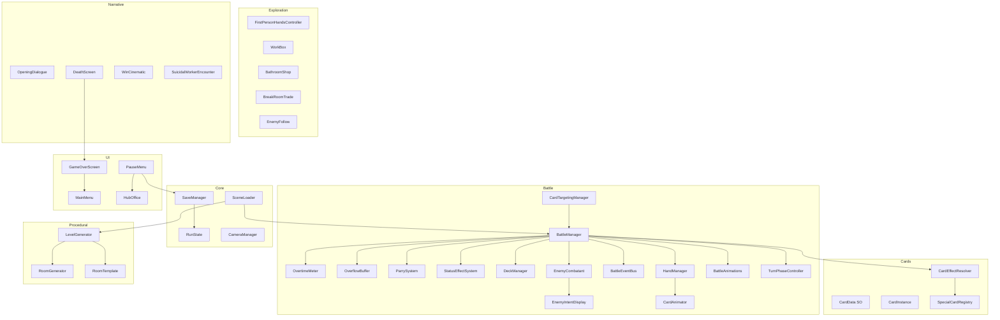
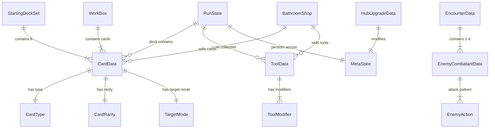

# Design Document: Card Battle System

## Overview

This design extends the existing `CardBattle` namespace in the Overtime Unity project to implement the full GDD-defined combat system. The current codebase provides a working foundation: a basic turn loop (`BattleManager`), card rendering with arc layout (`CardLayoutController`, `CardAnimator`), hover/select/targeting interactions (`CardInteractionHandler`, `CardTargetingManager`), a deck/discard cycle (`DeckManager`), single-enemy combat with `Health`, and scene transitions (`SceneLoader`).

The design replaces the generic "energy" integer with the Overtime Meter (capacity 10, regen 2/turn from turn 2), adds the Overflow Buffer and Rage Burst comeback mechanic, expands `CardData` to support five card types (Attack/Defense/Effect/Utility/Special) with four target modes and four rarity tiers, introduces multi-enemy encounters (1–4 enemies), status effects (Burn/Stun/Bleed), the Parry system as a skill-based active defense mechanic (replacing the passive Block system), enemy intent display with parry difficulty colors, and enemy attack pattern cycling. Beyond combat, the design covers first-person exploration hands, work box chests with rarity reveal, bathroom shops, break room NPC trades, procedural floor generation, run state persistence, hub office upgrades, narrative events, and all menu/UI screens.

The system targets Unity 2022+ with URP, C# scripting, and TextMeshPro for UI text.

## Architecture

The system follows a layered architecture within Unity's MonoBehaviour/ScriptableObject model:



### Key Architectural Decisions

1. **TurnPhaseController as a state machine**: The existing `TurnState` enum is expanded to `TurnPhase` (Draw, Play, Discard, Enemy) and managed by a dedicated `TurnPhaseController` component rather than inline in `BattleManager`. This keeps `BattleManager` as an orchestrator while phase transitions are explicit and testable.

2. **OvertimeMeter as a separate component**: Rather than tracking energy as a plain int on `BattleManager`, the Overtime Meter is its own `OvertimeMeter` MonoBehaviour with `Spend`, `Regenerate`, `GainFromDamage`, and overflow routing. This isolates the resource math (including Tool modifiers) from turn logic.

3. **CardEffectResolver pattern**: Card play resolution is delegated to a `CardEffectResolver` that switches on `CardType` and dispatches to type-specific handlers. Special cards use a `SpecialCardRegistry` dictionary mapping card IDs to `ISpecialCardEffect` implementations, so new specials don't require modifying the resolver. Defense cards played during the Play_Phase are treated as proactive parry attempts — the Overtime cost is deducted and the card goes to the discard pile, but the card may not match the next incoming enemy attack. During the Enemy_Phase, matching Defense cards can be played for free via the Parry_Window to cancel incoming damage.

4. **EnemyCombatant as a data+behaviour wrapper**: Each enemy in an encounter is represented by an `EnemyCombatant` MonoBehaviour holding HP, attack pattern index, status effects, and intent. The existing `Health` component is reused internally. `EnemyTargetable` is attached for targeting.

5. **RunState as a serializable POCO**: All run-scoped data (deck, Hours, Tools, floor, HP, cutscene flags) lives in a `RunState` class that `SaveManager` serializes to JSON. `BattleManager` reads/writes `RunState` rather than owning the data directly.

6. **Event-driven communication**: The existing `BattleEventBus` is extended with new event types (StatusEffectEvent removal, OverflowEvent, ParryEvent, TurnPhaseChangedEvent) so UI components can subscribe without direct references to game logic.

## Components and Interfaces

### Battle Components

| Component | Responsibility | Key API |
|---|---|---|
| `BattleManager` | Orchestrates encounter lifecycle, delegates to subsystems | `StartEncounter(EncounterData)`, `TryPlayCard(CardInstance, GameObject)`, `EndTurn()` |
| `TurnPhaseController` | Manages Draw→Play→Discard→Enemy state machine | `CurrentPhase`, `AdvancePhase()`, `OnPhaseChanged` event |
| `OvertimeMeter` | Tracks current/max OT, regen, overflow routing | `Spend(int)`, `Regenerate()`, `GainFromDamage(int hpLost, int maxHP)`, `Current`, `Max` |
| `OverflowBuffer` | Stores excess OT, consumed on next attack | `Add(int)`, `ConsumeAll() → int`, `Current` |
| `ParrySystem` | Manages parry windows during Enemy_Phase, validates parry matches, handles enemy parry chance | `StartParryWindow(EnemyAction, EnemyCombatant)`, `TryParry(CardInstance) → bool`, `IsParryWindowActive`, `GetMatchingCards(Hand) → List<CardInstance>` |
| `StatusEffectSystem` | Manages active effects on player and enemies | `Apply(target, StatusEffectData)`, `Tick(target)`, `GetEffects(target)` |
| `CardEffectResolver` | Resolves card effects by type | `Resolve(CardData, source, target(s))` |
| `SpecialCardRegistry` | Maps special card IDs to effect implementations | `Register(string id, ISpecialCardEffect)`, `Execute(string id, context)` |
| `EnemyCombatant` | Per-enemy state: HP, pattern, status, intent | `ExecuteAction()`, `TakeDamage(int)`, `CurrentIntent`, `IsAlive` |
| `EnemyIntentDisplay` | UI icon + damage number above enemy, updates in real-time as conditions change | `UpdateIntent(EnemyAction)`, `Hide()` |
| `DeckManager` | Draw pile, discard pile, shuffle | `Draw()`, `Discard(CardData)`, `ShuffleDiscardIntoDeck()`, `AddCard(CardData)` |
| `HandManager` | Visual hand of CardInstances | `AddCards(List<CardData>)`, `RemoveCard(CardInstance)`, `DiscardAll()` |
| `CardTargetingManager` | Card selection + target selection flow, supports targeting any entity including player | `SelectCard(CardInstance)`, `PlayOnTarget(GameObject)`, `CancelSelection()` |
| `BattleEventBus` | Pub/sub for battle events | `Raise<T>(T event)`, `OnCardPlayed`, `OnDamageDealt`, `OnStatusEffectApplied/Removed`, `OnTurnPhaseChanged` |

### ISpecialCardEffect Interface

```csharp
public interface ISpecialCardEffect
{
    void Execute(CardEffectContext context);
}

public struct CardEffectContext
{
    public CardData Card;
    public GameObject Source;
    public List<EnemyCombatant> Targets;
    public BattleManager Battle;
}

```

### Exploration Components

| Component | Responsibility | Key API |
|---|---|---|
| `FirstPersonHandsController` | Renders/animates 2D hand sprites on camera overlay | `SetState(HandState)`, `PlayInteraction()` |
| `WorkBox` | Chest under desks, rarity reveal mechanic | `Open()`, `RevealCard(int index)`, `KeepCard(int)`, `LeaveCard(int)` |
| `BathroomShop` | Buy cards/Tools, remove cards via toilet | `PurchaseCard(int)`, `PurchaseTool(int)`, `RemoveCard(CardData)` |
| `BreakRoomTrade` | NPC item-for-item trades | `AcceptTrade()`, `DeclineTrade()` |
| `EnemyFollow` (existing) | Patrol + chase AI | Extended with room-type avoidance, aggro flag, and safe room chase timeout |
| `WaterCooler` | Rest stop between floors, restores 35% max HP | `Interact()`, `IsUsed` |
| `FloorMinimap` | Corner minimap unlocked via Whiteboard hub upgrade | `UpdateVisited(Room)`, `SetRevealLevel(int)` |

### Persistence Components

| Component | Responsibility | Key API |
|---|---|---|
| `RunState` | Serializable POCO holding all in-run data | `Deck`, `Hours`, `BadReviews`, `Tools`, `Floor`, `HP`, `CutsceneFlags` |
| `MetaState` | Persistent data surviving death | `BadReviews`, `HubUpgrades`, `Achievements` |
| `SaveManager` | JSON serialization of RunState + MetaState | `SaveRun()`, `LoadRun()`, `SaveMeta()`, `LoadMeta()`, `WipeRun()`, `SnapshotPreEncounter()`, `RestorePreEncounter()` |

### UI Components

| Component | Responsibility |
|---|---|
| `MainMenu` | New Game / Continue / Settings / Achievements / Quit |
| `PauseMenu` | Resume / Hub Office / Settings / View Deck / View Tools / Quit to Main Menu |
| `GameOverScreen` | Run stats display + New Run / Main Menu buttons |
| `HubOffice` | 2D diorama with cursor interaction for Bad_Reviews upgrades |
| `PlayerHPStack` (existing) | Paper-stack HP visualization |
| `EnemyHPBar` (existing) | Fill-bar HP per enemy |
| `OvertimeMeterUI` | Displays current/max OT and overflow |
| `ParryWindowUI` | Shows active parry window timer, highlights matching Defense cards in hand |
| `DeckCounterUI` | Draw pile and discard pile counts, clickable to inspect pile contents |
| `EndTurnButton` | Button enabled during Play_Phase only, triggers end of player turn |
| `VictoryScreen` | Post-encounter splash showing randomized victory verb, enemy name, and rewards earned |
| `StartingDeckCarousel` | Deck set selection UI with left/right arrows, full card preview, and Select button |
| `TurnCounterUI` | Displays current turn number at top-center of battle screen |
| `FloatingCombatText` | Spawns floating damage/parry/cost/status numbers that drift and fade |
| `StatusEffectIconStack` | Vertical stack of active status effect icons with duration behind each entity |
| `CardEffectPreview` | Tooltip showing calculated effective values on card hover |

### Narrative Components

| Component | Responsibility |
|---|---|
| `OpeningDialogue` | YES/NO choice, joke ending vs. game start |
| `DeathScreen` | "Dragged back to desk" sequence |
| `WinCinematic` | Quiet going-home cinematic |
| `SuicidalWorkerEncounter` | Floor 5 special encounter with HP-based worker, Shield/Empathy resolution paths, different Tool rewards per path |
| `TutorialNPC` | First-run coworker guide: hub orientation as mundane office walkthrough, reacts with surprise when combat happens, confused UI prompts during first fight, Work_Box discovery |

## Data Models

### CardData (ScriptableObject — extends existing)

```csharp
public enum CardType { Attack, Defense, Effect, Utility, Special }
public enum CardRarity { Common, Rare, Legendary, Unknown }
public enum TargetMode { SingleEnemy, AllEnemies, Self, NoTarget }

[CreateAssetMenu(menuName = "CardBattle/CardData")]
public class CardData : ScriptableObject
{
    public string cardName;
    public int overtimeCost;
    [TextArea] public string description;
    public CardType cardType;
    public CardRarity cardRarity;
    public int effectValue;       // damage, draw count, restore amount, etc.
    public List<string> parryMatchTags; // used by Defense cards — defines which enemy attack types this card can parry
    public TargetMode targetMode;
    public Sprite cardSprite;

    // Effect card fields
    public string statusEffectId; // e.g. "Burn", "Stun", "Bleed"
    public int statusDuration;

    // Special card fields
    public string specialCardId;  // lookup key in SpecialCardRegistry

    // Utility card fields
    public UtilityEffectType utilityEffectType; // Draw, Restore, Retrieve, or Reorder
}

public enum UtilityEffectType { None, Draw, Restore, Retrieve, Reorder, Heal }
```

### EnemyCombatantData (ScriptableObject)

```csharp
public enum EnemyVariant { Coworker, Creature, Boss }

[CreateAssetMenu(menuName = "CardBattle/EnemyCombatantData")]
public class EnemyCombatantData : ScriptableObject
{
    public string enemyName;
    public int maxHP;
    public int hoursReward;      // Hours awarded on defeat
    public EnemyVariant variant;
    public Sprite sprite;
    public List<EnemyAction> attackPattern;
    public bool isBoss;
    [Range(0f, 1f)]
    public float enemyParryChance; // chance enemy parries a player's Attack card
    public float baseParryWindowDuration; // seconds, scales with difficulty/floor
    [TextArea] public string preFightDialogue;
    [TextArea] public string postFightDialogue;
}
```

### EnemyAction (extends existing)

```csharp
public enum EnemyActionType { DealDamage, ApplyStatus, Defend, Buff, Special }
public enum EnemyBuffType { None, DamageUp, DamageShield, Regen }
public enum IntentColor { White, Yellow, Red, Unparryable }

[Serializable]
public struct EnemyAction
{
    public EnemyActionType actionType;
    public int value;
    public string statusEffectId;
    public int statusDuration;
    // Buff-specific fields (used when actionType == Buff)
    public EnemyBuffType buffType;   // what kind of buff
    public int buffDuration;         // how many turns the buff lasts
    // Parry difficulty (used when actionType == DealDamage)
    public IntentColor intentColor;  // White/Yellow/Red/Unparryable — determines which Defense cards can parry this attack
    public List<string> parryMatchTags; // attack type tags for parry matching
    // Optional condition for conditional patterns
    public EnemyActionCondition condition;
}

public enum EnemyActionCondition { None, HPBelow50, HPBelow25, PlayerLowHP }
```

### StatusEffectData

```csharp
[Serializable]
public struct StatusEffectInstance
{
    public string effectId;     // "Burn", "Stun", "Bleed"
    public int duration;
    public int value;           // damage per tick for Burn, extra damage for Bleed
}
```

### EncounterData (ScriptableObject)

```csharp
[CreateAssetMenu(menuName = "CardBattle/EncounterData")]
public class EncounterData : ScriptableObject
{
    public List<EnemyCombatantData> enemies; // 1-4
    public bool isBossEncounter;
    public int badReviewsReward; // > 0 only for bosses
    // Note: Hours reward is per-enemy (EnemyCombatantData.hoursReward), totalled on victory
}
```

### RunState (serializable POCO)

```csharp
[Serializable]
public class RunState
{
    public int currentFloor;
    public int playerHP;
    public int playerMaxHP;
    public int hours;
    public int hoursEarnedTotal;           // running total for Game Over Screen
    public int badReviewsEarnedTotal;      // running total for Game Over Screen
    public List<string> deckCardIds;       // CardData asset names
    public List<string> toolIds;           // Tool asset names
    public List<string> seenCutsceneIds;   // cutscene flags
    public string startingDeckSetId;
    public bool isActive;                  // true if a run is in progress
    public int enemiesDefeated;            // counter for Game Over Screen display
    public int cardRemovalsThisRun;        // tracks toilet removals for escalating cost
}
```

### MetaState (serializable POCO)

```csharp
[Serializable]
public class MetaState
{
    public int badReviews;
    public Dictionary<string, int> hubUpgradeLevels; // "Computer" → 2, "Whiteboard" → 1, etc.
    public List<string> unlockedAchievements;
    public bool tutorialCompleted;
}
```

### HubUpgradeData (ScriptableObject)

```csharp
[CreateAssetMenu(menuName = "CardBattle/HubUpgradeData")]
public class HubUpgradeData : ScriptableObject
{
    public string upgradeId;       // "Computer", "CoffeeMachine", etc.
    public string displayName;
    public int maxLevel;
    public List<int> costPerLevel; // Bad_Reviews cost at each level
    public List<HubUpgradeEffect> effectsPerLevel; // what each level grants
    [TextArea] public string description;
    public List<Sprite> furnitureSprites; // visual per upgrade level
}

[Serializable]
public struct HubUpgradeEffect
{
    public ToolModifierType modifierType; // reuses the same enum as Tools
    public int value;                     // modifier value at this level
}
```

### StartingDeckSet (ScriptableObject)

```csharp
[CreateAssetMenu(menuName = "CardBattle/StartingDeckSet")]
public class StartingDeckSet : ScriptableObject
{
    public string setName;
    [TextArea] public string description;
    public List<CardData> cards; // exactly 8
}
```

### GameConfig (ScriptableObject)

```csharp
[CreateAssetMenu(menuName = "CardBattle/GameConfig")]
public class GameConfig : ScriptableObject
{
    public int finalFloor = 75;           // must be multiple of 3 (boss floor)
    public int baseHandSize = 5;
    public int overtimeMaxCapacity = 10;
    public int overtimeRegenPerTurn = 2;
    public int workerEncounterFloor = 5;
    public int bossFloorInterval = 3;
    public int breakRoomFloorInterval = 2;
    public int workerHP = 12;             // suicidal worker HP pool
    public int workerSelfDamage = 4;      // damage worker deals to himself per turn
    public int playerBaseHP = 80;         // Jean-Guy's starting max HP before Plant upgrades
    public int minimapBaseRevealLevel = 0; // 0 = no minimap, 1-3 = Whiteboard upgrade levels
    public int waterCoolerFloorInterval = 2; // water cooler every N floors
    public float waterCoolerHealPercent = 0.35f; // 35% of max HP
    public int shopMinCards = 3;
    public int shopMaxCards = 5;
    public int shopMinTools = 0;
    public int shopMaxTools = 2;
    public int cardRemovalBaseCost = 25;  // Hours cost for toilet card removal
    public int cardRemovalCostIncrease = 10; // additional cost per previous removal this run
    public int minimumDeckSize = 1;       // can't remove below this
    public int maximumDeckSize = 25;      // default cap, raised by Filing Cabinet upgrade
    public float safeRoomChaseTimeout = 5f; // seconds before chasing enemy gives up at safe room door
    public float baseParryWindowDuration = 1.5f; // seconds, default parry window length
    public float parryWindowFloorScaling = 0.02f; // seconds reduced per floor depth
    public float parryWindowMinDuration = 0.3f;   // minimum parry window duration
}
```

This centralizes all tunable game constants so designers can adjust balance without code changes.

### WorkBoxData

```csharp
public enum WorkBoxSize { Small, Big, Huge }

[Serializable]
public struct WorkBoxSpawnRates
{
    public float smallRate;
    public float bigRate;
    public float hugeRate;
}
```

### ToolData (ScriptableObject)

```csharp
public enum ToolModifierType { OvertimeRegen, ParryWindowBonus, HandSize, DamageBonus, MaxHP, HealPerFloor, TechCardDamage, MaxDeckSize }

[CreateAssetMenu(menuName = "CardBattle/ToolData")]
public class ToolData : ScriptableObject
{
    public string toolName;
    [TextArea] public string description;
    public Sprite toolSprite;
    public CardRarity rarity;
    public List<ToolModifier> modifiers; // supports multiple passive effects
}

[Serializable]
public struct ToolModifier
{
    public ToolModifierType modifierType;
    public int value; // e.g., +0.5s parry window, +2 OT regen, +5 max HP
}
```

Tools are passive relics (like Slay the Spire relics). They persist for the entire run, apply their modifiers automatically at encounter start or when relevant, and are lost on death. Tools can be found as rewards from the Suicidal Worker Encounter, purchased from Bathroom Shops, or obtained through Break Room trades.

### Key Relationships



### Rage Burst Diminishing Returns Formula

The Overflow Buffer to bonus damage mapping uses an exact lookup table with linear interpolation between reference points:

| Overflow Points | Bonus Damage % |
|---|---|
| 1 | +20% |
| 5 | +80% |
| 10 | +120% |
| 20 | +140% |

Implementation: A piecewise linear interpolation between the four GDD reference points. For overflow values between reference points, linearly interpolate (e.g., 3 overflow → lerp(20%, 80%, (3-1)/(5-1)) = 50%). Values above 20 are clamped at +140%. This guarantees exact GDD values at all reference points.

### Work Box Rarity Tables

| Floor Range | Common | Rare | Legendary | Unknown |
|---|---|---|---|---|
| 1–3 | 72% | 25% | 3% | 0% |
| 3–6 | 52% | 38% | 10% | 0% |
| 7–10 | 33% | 45% | 21% | 1% |
| 11–15 | 18% | 45% | 32% | 5% |
| 16–20 | 8% | 30% | 47% | 15% |
| 21–24 | 0% | 12% | 58% | 30% |
| 25+ | 0% | 1% | 69% | 30% |

### Work Box Size Spawn Rates

| Floor Range | Small | Big | Huge |
|---|---|---|---|
| 1–5 | 100% | 0% | 0% |
| 6–10 | 90% | 10% | 0% |
| 11+ | 70% | 25% | 5% |

### Work Box Card Counts

| Size | Min Cards | Max Cards |
|---|---|---|
| Small | 1 | 3 |
| Big | 3 | 5 |
| Huge | 5 | 7 |

### Bathroom Shop Pricing

| Card Rarity | Hours Cost |
|---|---|
| Common | 10 |
| Rare | 25 |
| Legendary | 100 |
| Unknown | 150 |

| Tool Rarity | Hours Cost |
|---|---|
| Common | 30 |
| Rare | 60 |
| Legendary | 200 |

Unknown rarity Tools are not available in shops.

Card removal via toilet costs 25 Hours base, +10 Hours per previous removal in the current run (tracked by `RunState.cardRemovalsThisRun`).


## Correctness Properties

*A property is a characteristic or behavior that should hold true across all valid executions of a system — essentially, a formal statement about what the system should do. Properties serve as the bridge between human-readable specifications and machine-verifiable correctness guarantees.*

### Property 1: Card Count Conservation

*For any* encounter state and any sequence of operations (draw, play, discard, shuffle, utility-draw, utility-retrieve), the total number of cards across the Draw_Pile, Hand, and Discard_Pile shall remain constant and equal to the deck size at encounter start.

**Validates: Requirements 7.4, 5.5, 19.7**

### Property 2: Deck Cycle Round Trip

*For any* non-empty Discard_Pile and empty Draw_Pile, shuffling the discard into the draw pile shall produce a Draw_Pile containing exactly the same card set (by identity) as the original Discard_Pile, and the Discard_Pile shall be empty afterward.

**Validates: Requirements 7.1, 7.3**

### Property 3: Draw Phase Hand Size

*For any* deck state (draw pile size D, discard pile size S, hand size 0), after the Draw_Phase completes, the hand size shall equal `min(baseHandSize, D + S)` — drawing up to the base hand size, reshuffling discard if needed, and stopping only when both piles are exhausted.

**Validates: Requirements 1.1, 7.1, 7.2**

### Property 4: Turn Phase Ordering

*For any* encounter, the Turn_Phase shall cycle in the strict order Draw → Play → Discard → Enemy → Draw → ..., and the first phase of the first turn shall always be Draw (player acts before enemies). Exception: when the player has an active Stun status effect, the Play phase is skipped (Draw → Discard → Enemy), as specified by Property 19a.

**Validates: Requirements 1.2, 1.5, 1.6, 1.7, 10.7**

### Property 5: Overtime Spend Correctness

*For any* Overtime_Meter value `current` and any card with cost `c`: if `c <= current`, playing the card shall reduce the meter to `current - c`; if `c > current`, the play shall be rejected and the meter shall remain at `current`.

**Validates: Requirements 2.3, 2.4**

### Property 6: Overtime Regeneration Capped

*For any* Overtime_Meter with current value `v` and maximum capacity `max`, regenerating at turn start (turn 2+) shall set the meter to `min(v + 2, max)`.

**Validates: Requirements 2.2**

### Property 7: Damage-to-Overtime Gain with Overflow Routing

*For any* damage instance where `actualHPLost` is the HP actually lost, `maxHP` is the player's maximum HP, and `current`/`max` are the Overtime_Meter values: the meter shall gain `floor(actualHPLost / maxHP * 10)` points, the meter shall not exceed `max`, and any excess shall be added to the Overflow_Buffer.

**Validates: Requirements 2.5, 2.6**

### Property 8: Rage Burst Formula

*For any* positive integer overflow value `n`, the Rage_Burst bonus damage percentage shall be computed via piecewise linear interpolation between the reference points (1→20%, 5→80%, 10→120%, 20→140%), clamped at 140% for values above 20. The formula must produce exactly 20% at 1, 80% at 5, 120% at 10, and 140% at 20.

**Validates: Requirements 3.3**

### Property 9: Rage Burst Consumption on Attack Only

*For any* card play where Overflow_Buffer > 0: if the card is an Attack type, all overflow points shall be consumed (buffer reset to 0) and the Rage_Burst bonus applied to damage; if the card is any other type (Defense, Effect, Utility, Special), the Overflow_Buffer shall remain unchanged and no bonus shall be applied.

**Validates: Requirements 3.2, 3.4, 3.5**

### Property 10: Parry Cancels Damage During Parry Window

*For any* enemy attack with damage `d` during the Enemy_Phase, if the player drags a matching Defense card (one whose parry match tags satisfy the attack's Parry_Match criteria based on Intent_Color) onto their character during the Parry_Window, the player shall take 0 damage from that attack, and the Defense card shall be moved to the Discard_Pile at no Overtime cost.

**Validates: Requirements 6.1, 6.2, 6.3, 9.2**

### Property 11: Missed Parry Deals Full Damage

*For any* enemy attack with damage `d` during the Enemy_Phase, if the Parry_Window expires without the player placing a matching Defense card, the player shall take the full `d` damage.

**Validates: Requirements 6.4**

### Property 12: Proactive Defense Card Costs Overtime

*For any* Defense card with Overtime cost `c` played during the Play_Phase (proactive parry), the Overtime_Meter shall decrease by `c` and the card shall be moved to the Discard_Pile. The proactive parry is prepared but does not guarantee a match against the next incoming enemy attack.

**Validates: Requirements 5.3, 6.5**

### Property 13: Attack Card Deals Correct Damage

*For any* Attack card with `effectValue` and Target_Mode Single_Enemy, playing it on an enemy with HP `h` and no status effects shall reduce that enemy's HP by `effectValue`. For Target_Mode All_Enemies, every living enemy in the encounter shall take `effectValue` damage.

**Validates: Requirements 5.1, 5.2, 8.4**

### Property 14: Dead Enemies Are Removed and Skipped

*For any* encounter, when an Enemy_Combatant's HP reaches 0, that enemy shall be excluded from all subsequent Enemy_Phase action execution, and when all enemies reach 0 HP, the encounter shall end as a player victory.

**Validates: Requirements 8.5, 8.6, 8.7**

### Property 15: Player Defeat at Zero HP

*For any* game state where the player's HP reaches 0 (during Enemy_Phase or from status effects), the encounter shall immediately end as a player defeat.

**Validates: Requirements 9.5**

### Property 16: Status Effect Duration Tick and Removal

*For any* set of active Status_Effects with durations `[d1, d2, ..., dn]`, after a turn-end tick, each duration shall be decremented by 1, and any effect whose duration reaches 0 shall be removed from the active list.

**Validates: Requirements 10.3**

### Property 17: Status Effect Refresh (No Stacking)

*For any* target with an active Status_Effect of type X with remaining duration `d1`, applying the same Status_Effect type X with duration `d2` shall result in exactly one instance of type X with duration `d2` (the new value), not two instances.

**Validates: Requirements 10.2**

### Property 18: Burn Deals Damage at Turn Start

*For any* target with an active Burn status effect of value `v`, at the start of that target's turn, the target shall take `v` damage.

**Validates: Requirements 10.4**

### Property 19: Stun Skips Enemy Action

*For any* Enemy_Combatant with an active Stun status effect, that enemy's action shall be skipped during the Enemy_Phase.

**Validates: Requirements 10.5**

### Property 19a: Stun Skips Player Play Phase

*For any* player turn where the player has an active Stun status effect, the Play_Phase shall be skipped — the player draws cards during Draw_Phase but cannot play any, and the turn automatically advances to Discard_Phase.

**Validates: Requirements 10.7**

### Property 20: Bleed Amplifies Incoming Damage

*For any* target with an active Bleed status effect of value `v`, when that target takes damage `d` from any source, the total damage dealt shall be `d + v`.

**Validates: Requirements 10.6**

### Property 21: Enemy Attack Pattern Cycling

*For any* Enemy_Combatant with an attack pattern of length `N`, the action executed on turn `t` (0-indexed) shall be the action at index `t % N` in the pattern (assuming no conditional overrides).

**Validates: Requirements 26.2**

### Property 22: Death Wipes Run State, Preserves Meta State

*For any* run state and meta state at the time of player death: after the death reset, the run state (deck, Hours, Tools, temporary modifiers) shall be wiped to initial values, while Bad_Reviews balance and hub office upgrade levels shall remain unchanged.

**Validates: Requirements 24.1, 24.2, 24.3**

### Property 23: Run State Persistence Round Trip

*For any* valid RunState object, serializing it via SaveManager and then deserializing shall produce an equivalent RunState with identical field values (floor, HP, deck card IDs, tool IDs, hours, cutscene flags).

**Validates: Requirements 27.5, 27.6**

### Property 24: Cutscene Seen Flag Persistence

*For any* cutscene event, after it plays and is marked as seen, loading the save shall report that cutscene as seen (skipping replay). Starting a new run shall clear all cutscene-seen flags.

**Validates: Requirements 27.1, 27.2, 27.3, 27.4**

### Property 25: Boss Floor Placement

*For any* generated floor layout across a run, boss encounter rooms shall appear at exactly floors 3, 6, 9, 12, ... (every 3rd floor), and no boss encounter shall appear on non-multiples of 3.

**Validates: Requirements 25.1, 33.6**

### Property 26: Work Box Card Count by Size

*For any* Work_Box, the number of cards it contains shall be within the range defined by its size: Small → [1, 3], Big → [3, 5], Huge → [5, 7].

**Validates: Requirements 21.3**

### Property 27: Shop Purchase Deducts Currency and Adds Item

*For any* Bathroom_Shop purchase where the player has `h` Hours and the item costs `c` where `c <= h`: after purchase, the player's Hours shall be `h - c`, and the purchased card/tool shall be in the player's inventory. If `c > h`, the purchase shall be rejected and Hours and inventory shall remain unchanged.

**Validates: Requirements 22.3, 22.4**

### Property 28: Card Removal via Toilet

*For any* deck containing card X and a toilet removal costing `c` Hours where the player has sufficient Hours: after removal, the deck shall no longer contain card X, the deck size shall decrease by 1, and Hours shall decrease by `c`.

**Validates: Requirements 22.5, 22.6**

### Property 29: Trade Conserves Inventory

*For any* Break_Room_Trade where the player has item A and the NPC offers item B: after accepting the trade, the player shall have item B and not item A. Declining shall leave the player's inventory unchanged.

**Validates: Requirements 23.5, 23.6**

### Property 30: Tool Modifier Application

*For any* active Tool that modifies a combat value (OT regen, parry window duration, hand size), the effective value used in combat shall equal `baseValue + toolModifier`. Multiple tools with the same modifier type shall stack additively.

**Validates: Requirements 15.2, 15.3, 15.4**

### Property 31: Utility Draw Card Effect

*For any* Utility card with a draw effect of value `N`, playing it shall result in `min(N, availableCards)` additional cards being drawn from the Draw_Pile into the Hand, where `availableCards` is the combined size of Draw_Pile and Discard_Pile (accounting for reshuffle).

**Validates: Requirements 19.1**

### Property 32: Utility Restore Overtime Effect

*For any* Utility card with a restore effect of value `N` and current Overtime_Meter value `v` with max `m`, playing it shall set the meter to `min(v + N, m)` and route any excess `max(0, v + N - m)` to the Overflow_Buffer.

**Validates: Requirements 19.2, 2.6**

### Property 33: Boss Floor Blocks Exit Until Defeated

*For any* boss floor, the exit to the next floor shall be locked while the boss Enemy_Combatant is alive, and shall unlock only after the boss is defeated.

**Validates: Requirements 38.3, 38.4, 38.5**

### Property 34: Heal Utility Capped at Max HP

*For any* Utility card with a Heal effect of value `H`, target current HP `hp`, and target max HP `maxHP`: after playing the card, the target's HP shall be `min(hp + H, maxHP)`. HP shall never exceed maxHP.

**Validates: Requirements 19.5**

### Property 35: Status Effect OT Gain Capped at 1 Per Tick

*For any* status effect tick (e.g., Burn) that deals damage `d` to the player with max HP `maxHP`, the Overtime_Meter shall gain at most 1 point from that tick, regardless of the damage amount or the standard damage-to-OT formula.

**Validates: Requirements 2.6**

### Property 36: Bleed Amplifies All Damage Sources Including Burn

*For any* target with an active Bleed status effect of value `v` that takes damage `d` from any source (including Burn ticks, enemy attacks, or self-damage), the total damage dealt shall be `d + v`. The Bleed bonus applies once per damage instance.

**Validates: Requirements 10.6**

### Property 37: Minimum Deck Size Enforced

*For any* deck of size `n` and a card removal attempt: if `n <= 1`, the removal shall be rejected and the deck shall remain unchanged. Card removal is only permitted when `n > 1`.

**Validates: Requirements 22.8**

### Property 38: One Toilet Flush Per Bathroom Visit

*For any* Bathroom_Shop visit, the player shall be permitted at most one card removal via the toilet. After one removal is performed, subsequent removal attempts in the same bathroom shall be rejected.

**Validates: Requirements 22.7**

### Property 39: Escalating Card Removal Cost

*For any* card removal attempt where the player has performed `r` previous removals in the current run, the cost shall be `baseCost + (r * costIncrease)` where baseCost = 25 Hours and costIncrease = 10 Hours. The cost increases monotonically with each removal.

**Validates: Requirements 43.5**

### Property 40: Water Cooler Heals Exactly 35% Max HP Once

*For any* water cooler interaction where the player has current HP `hp` and max HP `maxHP`, the player's HP after interaction shall be `min(hp + floor(maxHP * 0.35), maxHP)`. A second interaction with the same water cooler shall be rejected (one-time use).

**Validates: Requirements 42.2, 42.3**

### Property 41: Mid-Combat Save Restores Pre-Encounter State

*For any* quit during an active Encounter, the saved state shall reflect the run state at the start of that Encounter (before any combat actions). On resume, the player shall be in the exploration scene at the pre-battle position with the triggering enemy still present.

**Validates: Requirements 27.7**

## Error Handling

| Scenario | Handling |
|---|---|
| Card play with insufficient OT | Reject play, shake animation on card, no state change |
| Draw from empty deck + empty discard | Skip draw, hand may be smaller than base size |
| Damage to dead enemy | No-op, skip targeting dead enemies |
| Shop purchase with insufficient Hours | Reject purchase, display feedback message |
| Hub upgrade with insufficient Bad_Reviews | Reject purchase, display feedback message |
| Save file corrupted or missing | Start fresh run, preserve meta state if possible |
| Overflow buffer at max int | Clamp to reasonable max (e.g., 999) |
| Status effect applied to dead target | No-op, ignore application |
| Card targeting cancelled mid-selection | Return card to hand, restore pre-selection state |
| Scene load failure during battle transition | Log error, attempt reload, fallback to exploration scene |
| Empty encounter data (0 enemies) | Log error, skip encounter, return to exploration |
| Negative HP from multiple damage sources | Clamp HP to 0, trigger defeat once |
| Card removal at minimum deck size (1) | Disable toilet interaction, display feedback |
| Stun on player during Play_Phase | Skip Play_Phase, auto-advance to Discard_Phase |
| Multiple enemies chasing, one catches player | Only the catching enemy enters encounter, others resume patrol |
| Quit during active encounter | Save pre-encounter snapshot, resume in exploration with enemy still present |
| Heal exceeds target max HP | Clamp HP to maxHP, no overheal |
| Bleed + Burn tick on same target | Bleed bonus applies to Burn tick damage (d + bleedValue) |
| Stunned enemy during Enemy_Phase | Enemy action skipped, no parry window displayed for that enemy |
| Enemy chasing player into safe room | Enemy stops at doorway, gives up after ~5 seconds, resumes patrol |
| Player wins final boss | Door spawns, win cinematic plays on interaction, returns to Main Menu |
| Card addition at max deck size | Reject addition, display "deck full" feedback |

## Testing Strategy

### Dual Testing Approach

The card battle system requires both unit tests and property-based tests for comprehensive coverage.

**Unit Tests** focus on:
- Specific examples: initializing an encounter with known values and verifying exact state
- Edge cases: empty deck + empty discard draw, 0 HP defeat trigger, overflow at boundary values
- Integration points: scene transitions, event bus subscriptions, save/load cycles
- Narrative flow: opening dialogue branching, death screen → game over screen transition

**Property-Based Tests** focus on:
- Universal invariants that must hold across all valid inputs (card conservation, parry mechanics, OT arithmetic)
- Comprehensive input coverage through randomized card costs, damage values, deck compositions, and encounter configurations

### Property-Based Testing Configuration

- **Library**: [FsCheck](https://github.com/fscheck/FsCheck) for C# / NUnit integration in Unity Test Framework
- **Minimum iterations**: 100 per property test
- **Each property test must reference its design document property with a tag comment**
- **Tag format**: `// Feature: card-battle-system, Property {number}: {property_text}`
- **Each correctness property above maps to exactly one property-based test**

### Test Organization

```
Assets/
  Tests/
    EditMode/
      Battle/
        OvertimeMeterPropertyTests.cs    // Properties 5, 6, 7, 8, 35
        RageBurstPropertyTests.cs        // Property 9
        ParrySystemPropertyTests.cs      // Properties 10, 11, 12
        CardResolutionPropertyTests.cs   // Properties 13, 31, 32, 34
        DeckManagerPropertyTests.cs      // Properties 1, 2, 3
        StatusEffectPropertyTests.cs     // Properties 16, 17, 18, 19, 19a, 20, 36
        EnemyCombatPropertyTests.cs      // Properties 14, 15, 21
        TurnPhasePropertyTests.cs        // Property 4
      Persistence/
        RunStatePropertyTests.cs         // Properties 22, 23, 24, 41
      Economy/
        ShopPropertyTests.cs             // Properties 27, 28, 29, 37, 38, 39
        ToolModifierPropertyTests.cs     // Property 30
      Procedural/
        FloorGenerationPropertyTests.cs  // Properties 25, 26, 33
      Exploration/
        WaterCoolerPropertyTests.cs      // Property 40
    PlayMode/
      BattleIntegrationTests.cs
      SceneTransitionTests.cs
```

### Generator Strategy

Property tests require custom FsCheck generators for domain types:
- `CardData` generator: produces valid cards with random type, cost (0–10), effectValue (1–20), rarity, and target mode, ensuring type-specific fields are populated (e.g., Defense cards always have non-empty parryMatchTags)
- `DeckState` generator: produces a random partition of N cards (8–30) across draw pile, hand, and discard pile
- `OvertimeState` generator: produces random current/max OT values (0–10 / 10) and overflow buffer (0–50)
- `EnemyCombatant` generator: produces enemies with random HP (1–100), attack patterns (1–6 actions), and optional status effects
- `StatusEffect` generator: produces Burn/Stun/Bleed with random duration (1–5) and value (1–10)
- `RunState` generator: produces valid run states with random floor (1–25), HP, deck composition, hours, and tool sets
- `WaterCooler` generator: produces water cooler states with random player HP (1–80), maxHP (80), and used/unused flag
- `ShopState` generator: produces bathroom shop states with random inventory, player hours (0–500), and removal count (0–10)
